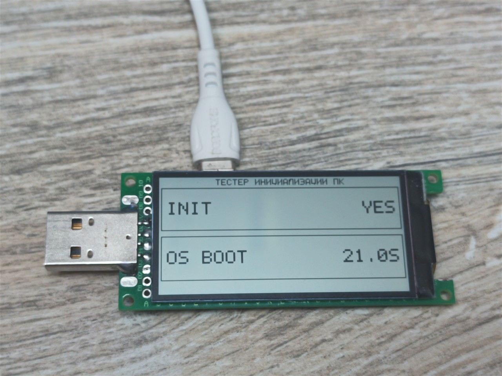
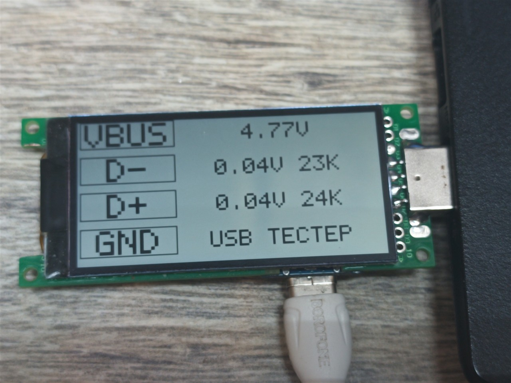
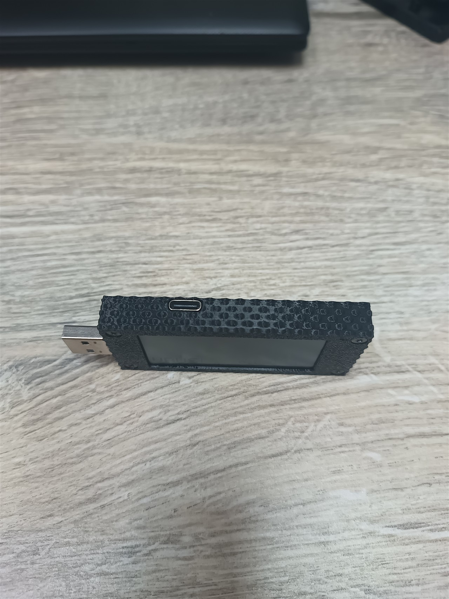
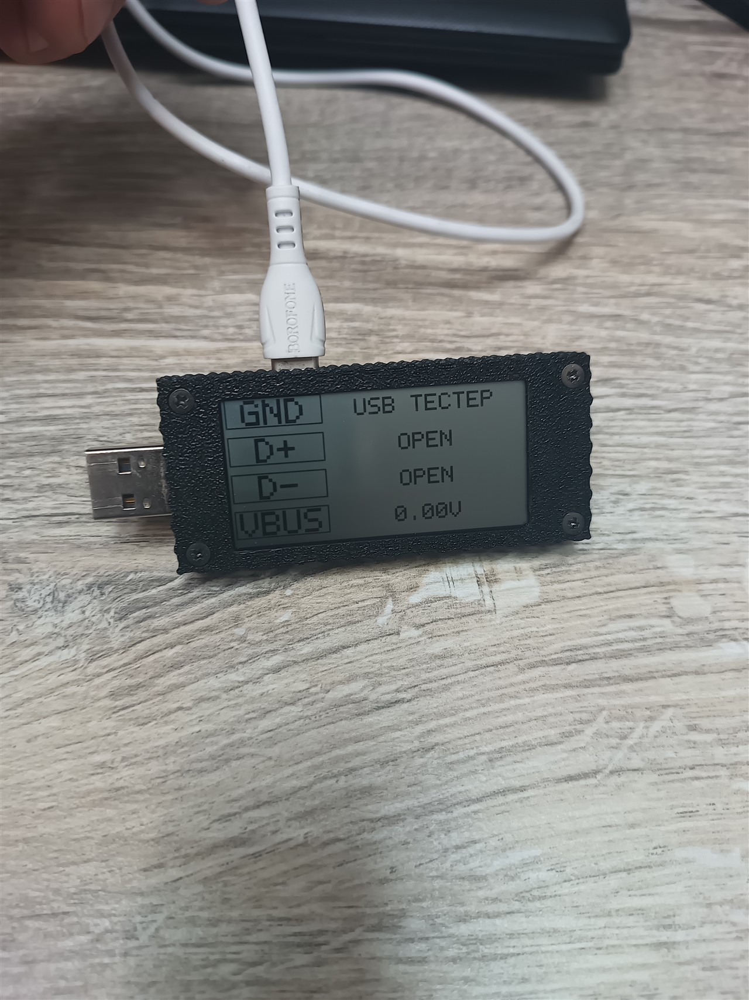
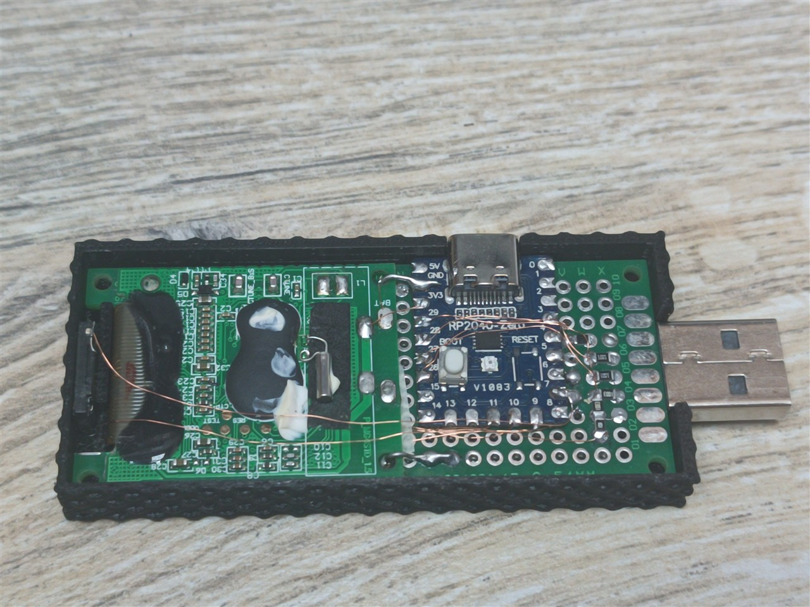

# G-Tag RP2040 Tools

Два измерительных прибора на одной плате **RP2040-Zero** с экраном от
электронного ценника **G-Tag (SES-imagotag)** 256×128.

| Инструмент | Что делает |
|---|---|
| **Тестер USB-портов** | щуп втыкается в порт ПК: измеряет VBUS, реальные уровни D+ и D−, сопротивление линий, находит замыкания и опознаёт зарядное устройство |
| **Тестер инициализации ПК** | USB-C втыкается в тестируемый компьютер: пассивно, без единого нажатия клавиши, измеряет шкалу загрузки — когда прошивка подняла USB и когда управление забрала операционная система |

Обе функции живут в одной прошивке
[`firmware/GTag_Tester`](firmware/GTag_Tester) и переключаются автоматически
или кнопкой.

---

## Как это выглядит

Экран тестера портов:

```
1 VBUS              4.77V
2 D-                0.02V 25K
3 D+                0.02V 25K
4 GND              USB ТЕСТЕР
```

Экран тестера инициализации:

```
        ТЕСТЕР ИНИЦИАЛИЗАЦИИ ПК
┌──────────────────────────────────┐
│  INIT                YES         │
└──────────────────────────────────┘
┌──────────────────────────────────┐
│  OS BOOT            27.4S        │
└──────────────────────────────────┘
```

Схемы подключения: [распиновка](images/pinout.svg) ·
[щуп с делителем](images/probe.svg) · [подключение экрана](images/lcd.svg).

Живые снимки: [тестер портов на столе](images/photos/running-port.jpg) ·
[замер живого порта](images/photos/measuring-live-port.jpg) ·
[режим инициализации](images/photos/running-init.jpg) ·
[внутренности сборки](images/photos/inside.jpg) ·
[в корпусе](images/photos/case-closed.jpg).





---

## Железо

| Что | Зачем |
|---|---|
| RP2040-Zero | мозг, USB-контроллер и АЦП |
| Экран от ценника G-Tag 256×128 | индикатор, четыре сигнальных провода |
| Плата ценника (остаётся в сборе) | питание экрана и **DisplayCLK 28,8 кГц** |
| USB-A штекер на проводах | измерительный щуп тестера портов |
| Динамик | сигнал о замыкании и о подтверждённой инициализации |

Всё это собрано на **макетной плате 3×7 см**: на ней разместились RP2040-Zero,
обвязка щупа (делитель 100к/100к, резисторы 1к, эталон 10к) и динамик. Экран
вынесен на четырёх проводах, плата ценника остаётся в своём корпусе и даёт
`DisplayCLK`.

### Распиновка RP2040-Zero (USB-C сверху)

```
        левый край                 правый край
        5V        (1)              (23)  GP0
        GND       (2)              (22)  GP1
        3V3       (3)              (21)  GP2
        GP29      (4)              (20)  GP3
        GP28      (5)              (19)  GP4
        GP27      (6)              (18)  GP5
        GP26      (7)              (17)  GP6
        GP15      (8)              (16)  GP7
        GP14      (9)              (15)  GP8
              нижний торец:  GP13(10) GP12(11) GP11(12) GP10(13) GP9(14)
```

### Подключение

| Сигнал | GPIO |
|---|---|
| Экран: RESET / CS / CLK / DIO | GP8 / GP9 / GP10 / GP11 |
| Экран: GND | GND |
| Щуп: VBUS через делитель 100к/100к | GP26 |
| Щуп: D− через 1к | GP27 |
| Щуп: D+ через 1к | GP28 |
| Эталонный резистор 10к на GND | GP29 |
| Динамик | GP7 |

Подробности, включая защиту линий данных и проверку мультиметром перед
первым включением — в [docs/wiring.md](docs/wiring.md).

Как снять экран со штатного ценника и что там перерезать — в
[docs/tag-preparation.md](docs/tag-preparation.md).

## Корпус

Печатный корпус под эту сборку лежит в [hardware/stl](hardware/stl) — три
STL-файла, печать на FDM, стягивается четырьмя винтами. Внутри помещаются
RP2040-Zero, обвязка щупа и динамик; USB-C и кнопка BOOT выведены наружу,
щуп выходит слева.







---

## Быстрая прошивка готовым файлом

Собирать самому не обязательно. Готовый бинарник лежит в
[`firmware/GTag_Tester.uf2`](firmware/GTag_Tester.uf2).

1. Зажать **BOOT** на плате и подключить USB-C — появится диск `RPI-RP2`.
2. Перетащить на него `GTag_Tester.uf2`.
3. Плата сама перезагрузится и запустится.

Собрано под `Waveshare RP2040 Zero` со стеком Adafruit TinyUSB. Формат UF2
привязан к семейству чипа, а не к конкретной модели платы, поэтому файл
подойдёт любому RP2040.

## Сборка из исходников

Скетч для **Arduino IDE 2.x** с ядром
[Raspberry Pi Pico/RP2040 by Earle Philhower](https://github.com/earlephilhower/arduino-pico).

1. **File → Preferences → Additional boards manager URLs:**
   `https://github.com/earlephilhower/arduino-pico/releases/download/global/package_rp2040_index.json`
2. **Tools → Boards → Boards Manager** → установить *Raspberry Pi Pico/RP2040*.
3. **Tools → Board** → `Waveshare RP2040 Zero`.
4. **Tools → USB Stack → Adafruit TinyUSB.** Это обязательно: тестер
   инициализации представляется HID-клавиатурой, а без TinyUSB сборка
   останавливается с ошибкой «TinyUSB is not selected».
5. Открыть `firmware/GTag_Tester/GTag_Tester.ino`, залить. Первая заливка —
   с зажатой кнопкой BOOT (плата определится как диск `RPI-RP2`).

---

## Тестер USB-портов

Щуп идёт в порт под тестом, питание — от зарядки, вставленной в USB-C.

Для каждой линии измеряется реальное напряжение, классифицируется состояние
сети и оценивается сопротивление до земли:

| Состояние | Что означает |
|---|---|
| `OPEN` | линия ни к чему не подключена |
| `HOST PULL-DOWN` | видны подтяжки хоста 15к — порт живой |
| `DEVICE PULL-UP` | линию держит вверху подключённое устройство |
| `SHORT TO GND` | линию не поднять, она на земле |

КЗ между D+ и D− ищется так: одна линия подтягивается вверх, вторая вниз, и
если они «съезжают» вместе — значит замкнуты. На экране между строками
появляется двусторонняя стрелка, а динамик пищит.

Зарядное устройство опознаётся по подписи BC1.2: у него D+ и D− соединены
накоротко, поэтому обе линии высокие и одинаковые. Это тоже считается
замыканием и тоже озвучивается — тестер не делает скидок на то, что так
задумано производителем.

### Как измеряется сопротивление

Сопротивление считается по внутренней подтяжке RP2040, а её номинал плавает
в диапазоне 40–80к. Поэтому при старте прошивка калибруется по двум известным
резисторам на плате: эталонному 10к на GP29 и нижнему плечу делителя 100к на
GP26. Из двух уравнений находятся сразу оба неизвестных — сопротивление
подтяжки и реальное напряжение её шины.

Проверка на живом примере: 15к, припаянные к линии вместо щупа, показываются
как 16к — с учётом последовательного резистора 1к. Подробности в
[docs/calibration.md](docs/calibration.md).

---

## Тестер инициализации ПК

USB-C идёт в компьютер под тестом, устройство представляется HID-клавиатурой.
Дальше **не нажимается ни одна клавиша** — тестер только слушает то, что хост
делает сам.

| Метка | Событие |
|---|---|
| `INIT` | хост перечислил устройство. Это и есть инициализация порта, и она фиксируется независимо от того, прошивка это или ОС |
| `OS BOOT` | время от инициализации до того, как дала о себе знать ОС: либо сброс шины и повторное перечисление, либо состояние лампочек клавиатуры, которое присылает драйвер |

### Почему без нажатий

Нажатие клавиши даёт ответ только если хост уже обрабатывает клавиатуру:
BIOS, поднявший порт, но не загрузивший драйвер ввода, промолчит. Поэтому
тестер слушает только то, что хост делает сам:

- **перечисление устройства** — присвоение USB-адреса и конфигурация;
- **трафик на шине** — хост опрашивает нас постоянно, пока жив;
- **состояние лампочек** (`SET_REPORT`, выходной отчёт) — Windows и Linux
  присылают его при загрузке драйвера, без единого нажатия;
- **смена протокола boot → report** — признак того, что управление забрала ОС.

Кнопка BOOT: короткое нажатие — перезапуск замера, долгое — переключение
режима прибора.

---

## Что внутри экрана

Протокол LCD восстановлен не на глаз: последовательность команд, формат
9-битных слов и тайминги сверены с записью логического анализатора, снятой с
штатной прошивки ценника в проекте
[**lukdut/gtag-nrf-display**](https://github.com/lukdut/gtag-nrf-display)
(лицензия MIT). Драйвер LCD в этом репозитории — его порт на RP2040.
Инициализация отправляет ровно 4172 слова, кадр — 4100, и это совпадает
байт в байт. Разбор — в [docs/lcd-protocol.md](docs/lcd-protocol.md).

Огромная благодарность автору того проекта: без снятого захвата пришлось бы
разбирать протокол вслепую.

---

## Автор

Евгений Кузьмин ([@Qwarts13](https://github.com/Qwarts13)).

## Лицензия

MIT, см. [LICENSE](LICENSE).
