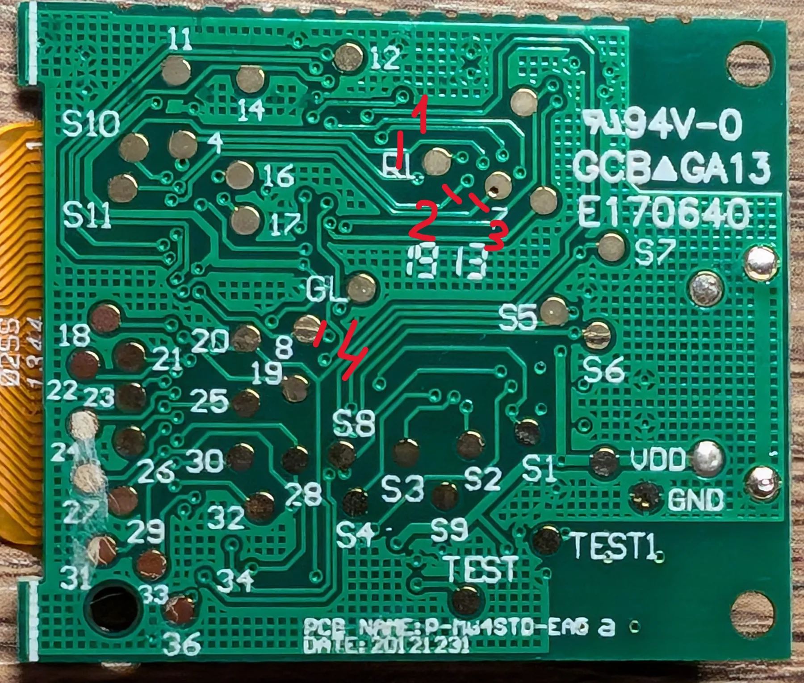
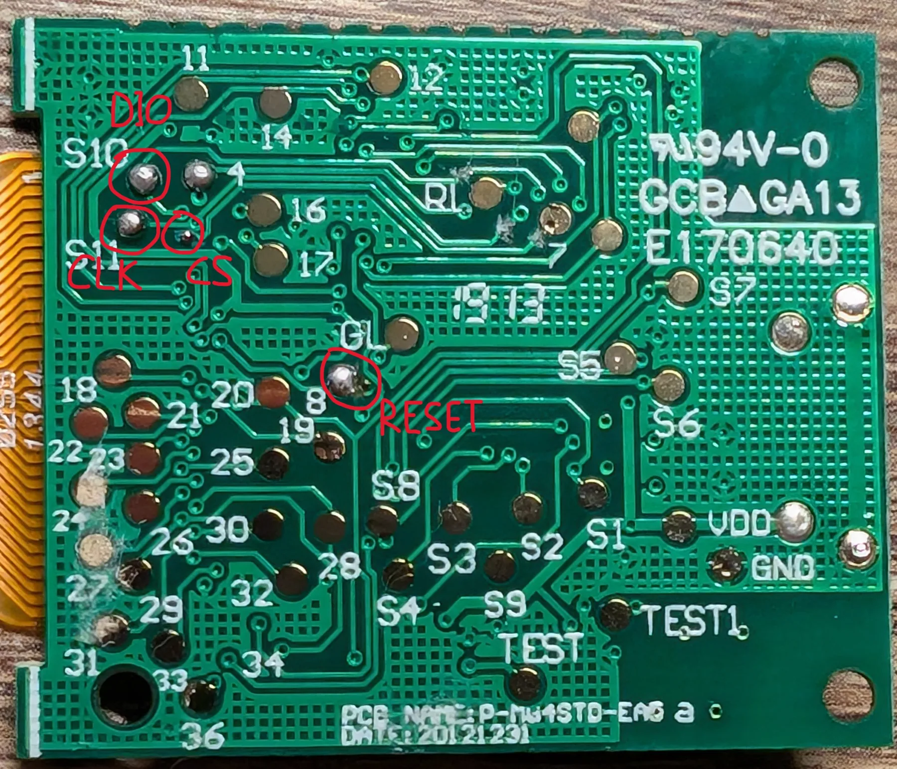

# Подготовка платы ценника

Экран, который мы используем, снят со штатного электронного ценника G-Tag.
Штатная плата ценника при этом **остаётся в сборке и работает**: именно она
питает LCD и выдаёт тактирование `DisplayCLK / S1` на 28,8 кГц. Прошивка
RP2040 этот сигнал не формирует.

Наша задача — перерезать четыре дорожки, отделив линии управления LCD от
штатного контроллера ценника, и вывести эти четыре сигнала наружу.

> **Не путать:** `CLK` в таблице ниже — это тактовая линия передачи данных,
> отдельный провод. `DisplayCLK / S1` — другой сигнал, его трогать не нужно,
> он так и остаётся на плате ценника.

## Порядок работы

### 1. Открыть корпус

Поддеть защёлки отвёрткой и вынуть сборку платы с экраном.

### 2. Отклеить плату от экрана

Плата держится на двустороннем скотче. Аккуратно поддеть край и прикладывать
небольшое постоянное усилие — скотч постепенно отпустит. Не тянуть резко и не
натягивать шлейф.

### 3. Перерезать четыре дорожки

Очистить обратную сторону платы от остатков скотча (механически или спиртом)
и дать высохнуть. Перерезать дорожки **в четырёх местах**, отмеченных красными
штрихами на фото:

После работы обязательно проверить мультиметром, что каждый разрез
действительно разрывает нужную дорожку, а соседние остались целыми.

### 4. Подготовить точки пайки

Найти четыре точки **DIO, CLK, CS и RESET**, залудить их:

### 5. Припаять провода

Уложить четыре сигнальных провода вдоль поверхности платы, чтобы они не
торчали перпендикулярно. Питание вывести двумя проводами: плюс и минус.

## Куда что идёт на RP2040

| Провод от экрана | GPIO на RP2040-Zero | Пин на плате |
|---|---|---|
| RESET | GP8 | 15 |
| CS | GP9 | 14 |
| CLK | GP10 | 13 |
| DIO | GP11 | 12 |
| GND | GND | 2 |

Плюс обязательная общая земля между RP2040 и платой ценника.

## Источник

Фотографии и порядок операций взяты из проекта
[lukdut/gtag-nrf-display](https://github.com/lukdut/gtag-nrf-display), раздел
`docs/display-preparation.md` (лицензия MIT). Там же описан вариант разводки,
когда переходное отверстие находится рядом с контрольной площадкой, а не на
ней — на некоторых ревизиях платы разрез делается иначе.
